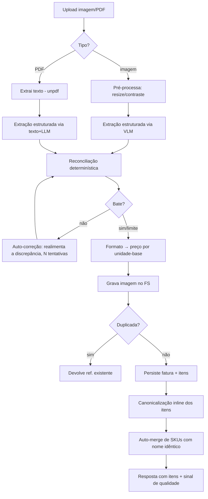
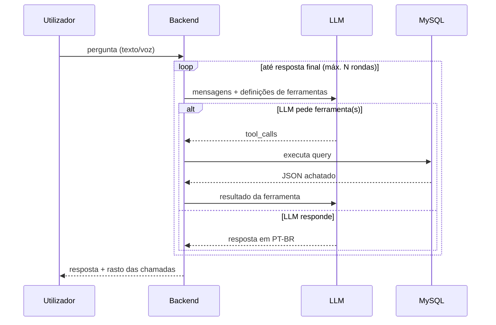

# Bigbag — Arquitetura

> Documento técnico para leitura e análise por engenharia. Descreve a estrutura,
> os fluxos e as decisões de design da aplicação. Não contém segredos,
> credenciais, endereços de infraestrutura nem dados de utilizador.

## 1. O que é

Bigbag é uma aplicação pessoal (utilizador único) de **histórico de preços de
compras de supermercado**. O utilizador fotografa ou carrega o talão/fatura; o
sistema extrai os itens e preços, normaliza cada produto para um identificador
canónico, valida a leitura por reconciliação aritmética, e guarda tudo numa base
relacional. Depois responde a perguntas em linguagem natural (texto ou voz) do
tipo *"onde está mais barato o azeite?"*, *"quanto gastei em laticínios em
maio?"*, *"quanto paguei pela última manteiga?"*.

Por ser laboratório de utilizador único, **não há multi-tenancy**: o modelo de
dados não tem `user_id` nas tabelas de domínio e a autorização é binária
(sessão válida ou não).

## 2. Stack tecnológica

| Camada | Tecnologia |
|---|---|
| Frontend | React 18 + Vite, PWA (service worker via `vite-plugin-pwa`). Sem framework de routing — *routing por path* em `main.jsx`. Sem libs de estado/UI (estado local + `localStorage`). |
| Backend | Node.js (≥20), Express 4. ES Modules. Dependências mínimas: `mysql2`, `multer` (uploads), `sharp` (pré-processamento de imagem), `unpdf` (extração de texto de PDF), `dotenv`. |
| Base de dados | MySQL 8 (InnoDB, `utf8mb4`). Acesso por SQL direto via `mysql2/pool` — sem ORM. |
| IA | Todos os modelos via **OpenRouter** (API compatível com OpenAI), uma única chave. Cobre texto, visão (VLM) e áudio. Modelos configuráveis por variável de ambiente. |
| Deployment | Serviço Node atrás de um *reverse proxy* (TLS terminado no proxy), gerido por `systemd` (auto-restart). Escuta apenas em `localhost` numa porta dedicada. |

**Princípio transversal:** dependências mínimas e deliberadas. A lógica difícil
(reconciliação, normalização, formato) é código próprio, testável e isolado, em
vez de delegada a bibliotecas ou empurrada para o prompt do LLM.

## 3. Topologia

```
   Browser (PWA)
        │  HTTPS
        ▼
   Reverse proxy (TLS, vhost)
        │  HTTP localhost:<porta>
        ▼
   Node/Express  ──────►  OpenRouter (LLM/VLM/áudio)
        │
        ├──►  MySQL (app_bigbag)
        └──►  Filesystem (/var/lib/<app>/comprovantes, notas de voz)
```

- O backend serve **apenas a API** (`/api/*`) e o `/health`. Os ficheiros
  estáticos do frontend (build do Vite) são servidos pelo proxy.
- Os comprovantes originais (imagem/PDF) e as notas de voz são gravados no
  filesystem com permissões restritas; a BD guarda apenas o caminho.

## 4. Estrutura do repositório

```
backend/
  src/
    server.js            Bootstrap Express, rotas, /health, shutdown limpo
    config.js            Configuração derivada do ambiente
    db.js                Pool MySQL
    auth.js              Middleware requireAuth (sessão)
    openrouter.js        Cliente único do LLM (texto/visão/áudio), com custos
    routes/
      faturas.js         POST ingestão + GET imagem da nota
      consulta.js        Consulta por texto
      voz.js             Consulta por voz (áudio → transcrição → consulta)
      admin.js           API do operador (gestão de SKUs, revisão de notas)
      explorar.js        API do explorador de preços
    ingest/              PIPELINE DE INGESTÃO
      imagem.js          Pré-processamento de imagem (resize/contraste, sharp)
      pdf.js             Extração de texto de PDF (unpdf)
      extract.js         Extração estruturada via LLM (VLM ou texto+LLM)
      reconcile.js       Reconciliação determinística (convenção A/B, sinal honesto)
      normalize.js       Dobra linhas de desconto/peso na descrição
      classify.js        Classificação da loja (supermercado/farmácia/outro)
      persist.js         Gravação + deduplicação
    normaliza/           NORMALIZAÇÃO DE PRODUTO (3 camadas)
      formato.js         Parsing de formato/peso → preço por unidade-base
      canonical.js       Canonicalização por LLM (nome + correção de OCR)
      similaridade.js    Similaridade de nomes (match determinístico)
      matcher.js         Orquestra alias-cache → canonical → match; auto-merge
      abreviaturas.js    Dicionário de abreviaturas de talão
    consulta.js          Orquestrador de tool-use (loop pergunta→ferramenta→resposta)
    tools.js             Definições das ferramentas + dispatch
    queries.js           Implementação SQL de cada ferramenta de consulta
    historico.js         Histórico da conversa
    perfil.js            Memória de longo prazo (factos sobre o utilizador)
    custo.js             Agregação de custos e de qualidade de extração
  migrations/            SQL versionado (001 … 012)
  test/                  Testes (node:test); lógica pura local, BD/LLM no servidor
frontend/
  src/
    main.jsx             Routing por path: / (app) · /admin · /explorar
    App.jsx              PWA do utilizador (chat, captura, carrinho)
    Admin.jsx            Interface de operador (desktop)
    Explorar.jsx         Explorador de preços (desktop)
    api.js · adminApi.js · explorarApi.js   Clientes HTTP
    i18n.js              Localização (base PT-BR; tradução = novo dicionário)
    scanner.js · vendor/jscanify.js   Digitalização/dewarp de documento
docs/                    Conceito, Schema, Runbook, este documento
```

## 5. Modelo de dados

Quatro tabelas centrais e um conjunto de auxiliares. Chaves naturais úteis
(`loja.nif`, número de fatura) suportam deduplicação.

```
        loja 1───∞ fatura 1───∞ item ∞───1 sku_normalizado 1───∞ sku_alias
                                                  ▲
                              (descricao_original)│ (cache de resolução)
```

**`loja`** — cada estabelecimento (cadeia, tipo, NIF, localização). NIF é chave
natural única.

**`sku_normalizado`** — o **produto canónico**: o que liga o mesmo produto
escrito de formas diferentes entre lojas e datas. É o coração da comparação.
Campos: `nome_canonico` (sem marca nem formato), `marca`, `categoria`,
`unidade_base` (`un`/`kg`/`L`), `formato_valor`, e `nome_simplificado`
(agrupamento grosseiro opcional, preenchido pelo operador — ex.: "Leite UHT
gordo Mimosa" → "Leite").

**`fatura`** — uma compra. Guarda `total_impresso` **e** `total_reconciliado`
para validar a extração, mais o sinal `discrepancia`, `needs_review`,
`desconto_global`, `metodo_extracao` (`vlm`/`ocr_llm`), `origem_captura`
(`scan`/`foto`/`galeria`/`arquivo`) e um snapshot `extracao_json` para debug.

**`item`** — cada linha do talão. Guarda a `descricao_original` crua (nunca se
perde — permite auditar a normalização) e a ligação ao SKU (`sku_id`, nulo até
ser resolvido). Preços: `preco_liquido` (preço impresso na linha) e
`preco_por_base` (€/kg, €/L ou €/un — o campo que torna a comparação
correcta). Flags de regra de negócio: `is_clearance` (fim de validade),
`is_non_product` (saco, taxa).

**Auxiliares:** `sku_alias` (cache `descricao_original → sku_id`),
`mensagem` (histórico da conversa), `perfil`/factos (memória de longo prazo),
`revisao` (veredicto humano do operador sobre cada nota), `custo_chamada`
(telemetria de custo/qualidade por chamada ao modelo).

### Decisões de modelo notáveis

- **`preco_por_base` é o que faz a comparação funcionar.** Para itens a peso, o
  preço pago sozinho não é comparável; €/kg é. Todas as funções de comparação
  consultam `preco_por_base` e filtram `is_clearance`/`is_non_product`.
- **A `descricao_original` nunca se perde.** É a fonte de verdade para depurar a
  normalização e para o operador reassociar.
- **Qualidade embutida no schema.** `total_reconciliado` vs `total_impresso` (e
  o `discrepancia` derivado) é uma métrica de confiança da extração que vive na
  própria linha — notas que não batem são marcadas `needs_review` e **excluídas
  das análises de preço**.

## 6. Pipeline de ingestão

O fluxo de `POST /api/faturas` (multipart: imagem ou PDF), todo atrás de auth:



Pontos a destacar:

- **Duas abordagens de extração, registadas por nota.** Imagem → VLM direto;
  PDF → extração de texto + LLM. `metodo_extracao` regista qual gerou cada
  registo, para comparação empírica futura. A extração devolve sempre o mesmo
  *schema* JSON (loja, data, subtotal, desconto global, total, itens).
- **Loop de auto-correção.** Se a reconciliação não bate, a discrepância é
  realimentada ao modelo como pista ("a soma deu X mas o total é Y"); fica-se
  com a melhor tentativa, com limite de iterações para não gastar sem ganho.
- **Deduplicação na persistência.** Por número de fatura quando existe; senão
  por (loja, data, total). Uploads repetidos não duplicam dados (a imagem órfã
  é apagada).
- **Best-effort após gravar.** Canonicalização e auto-merge correm fora de
  qualquer transação e não bloqueiam o upload: se falharem, o item fica sem SKU
  e um script de lote é a rede de segurança.

## 7. Reconciliação (sinal honesto)

`reconcile.js` é lógica determinística pura (sem LLM, com testes unitários).
Resolve duas convenções de talão, auto-detectadas pelo TOTAL A PAGAR:

- **Convenção A** (ex.: Continente): o `valor` da linha já é líquido; a
  "Poupança" é informativa. `total ≈ Σ valor − desconto_global`.
- **Convenção B** (ex.: Lidl): o `valor` é bruto e o desconto da linha é real e
  subtraído. `total ≈ Σ(valor − desconto_linha) − desconto_global`.

Decisões-chave:

- **O preço de cada item é o impresso na linha.** O desconto global ("Desconto
  Cartão") é um desconto **da nota**, aplicado no pagamento e não atribuível a
  produtos específicos — **não é espalhado** pelos itens. Distribuí-lo
  cêntimo-a-cêntimo distorcia cada preço (um sumo de 2,49 aparecia como 2,37).
  Fica só em `fatura.desconto_global`.
- **A discrepância é um sinal honesto, não um número a forçar.** Em vez de
  "raspar" cêntimos dos itens para a soma bater com o total, calcula-se
  `Σbase − desconto_global − total` e regista-se. Se ≠ 0, a extração perdeu,
  inventou ou leu mal um item/desconto → `needs_review`, fora das análises.

## 8. Normalização de produto (3 camadas)

Transformar `"BOL DIGESTIVE AVEIA CNT 425GR"` no SKU canónico
`"Bolacha Digestive de Aveia"` é a parte difícil, isolada em `normaliza/`:

1. **Formato → unidade-base** (`formato.js`, determinístico): faz o parsing de
   peso/volume/contagem ("425GR", "2K", "6×200ml", "meia dúzia") para calcular
   `preco_por_base`. Sem este passo a comparação entre formatos é impossível.
2. **Canonicalização por LLM** (`canonical.js`): devolve nome canónico (sem
   marca nem formato) + marca + categoria + unidade + confiança. **Corrige erros
   óbvios de OCR** ("OLO GIRASSOL"→"Óleo de Girassol") com conhecimento de
   produto, mas com guarda-corpos: **nunca altera números**, **nunca inventa**
   (se ilegível, baixa a confiança e o item fica para revisão), e a descrição
   crua fica sempre para auditoria.
3. **Resolução/Match** (`matcher.js`): `resolverSku` segue
   **alias-cache** (instantâneo) → **canonicalização** → **match por
   similaridade** sobre candidatos da mesma marca/unidade/formato. Acima de um
   limiar faz match automático; na zona cinzenta um juiz LLM confirma; abaixo
   cria SKU novo. Nomes canónicos idênticos reutilizam sempre o mesmo SKU
   (evita duplicados). Cada resolução grava um alias para a próxima vez.

A correspondência **produto em linguagem natural → SKU** é também do backend
(não do prompt de consulta): isola a parte difícil numa camada testável.

## 9. Consulta (tool-use)

`consulta.js` implementa um loop de *tool use* clássico, sem slot-filling:



- **9 ferramentas:** `buscar_ultima_compra`, `comparar_precos_por_loja`,
  `produtos_habituais`, `detalhes_fatura`, `produto_mais_barato`,
  `historico_preco`, `listar_compras`, `total_gasto`, `lembrar`.
- **Memória da conversa** é injectada (perguntas elípticas — "e no Lidl?" —
  reutilizam os filtros anteriores). **Memória de longo prazo**: a ferramenta
  `lembrar` grava factos duráveis do utilizador no perfil, reinjectados no
  *system prompt*.
- **O system prompt centraliza o idioma e o comportamento** (PT-BR, conversão de
  períodos relativos para ISO, "agir sobre intenção clara em vez de perguntar").
  É o ponto único a tornar *locale-driven* quando houver 2.º idioma.
- As ferramentas são uma biblioteca SQL testável (`queries.js`), com teste de
  integração por transacção + `ROLLBACK`.

## 10. Voz

`POST /api/voz` (multipart áudio) → **transcrição** (`transcricao.js`) → a
**mesma** cadeia de tool-use da consulta por texto. A transcrição está numa
camada trocável: a v1 usa áudio-direto ao modelo de chat (`input_audio` em
base64; URLs não são suportados para áudio). A nota de voz é guardada e a
transcrição visível é devolvida (útil para depurar PT europeu).

## 11. Superfícies de frontend

Três aplicações no mesmo bundle, escolhidas por *path* em `main.jsx`:

- **App do utilizador (`/`)** — PWA mobile-first: captura de nota (digitalizar
  documento com dewarp / foto / galeria em lote / arquivo-PDF multi-selecção),
  chat de perguntas, e **carrinho de compras** (toca nos produtos habituais →
  carrinho agrupado por secção de mercado, swipe para apagar, persistido em
  `localStorage`).
- **Operador (`/admin`)** — desktop: gerir SKUs canónicos (renomear,
  associar/dissociar descrições, fundir produtos, auto-merge de nomes
  idênticos), rever a leitura de cada nota (imagem + itens lado a lado, marcar
  certa/errada com comentário), editar quantidades, e ver qualidade por
  cadeia/origem de captura.
- **Comprador (`/explorar`)** — desktop: explorar produtos, preço pago vs por
  unidade, variação ao longo do tempo (gráfico desenhado em canvas, sem libs),
  comparação por mercado, com selector de mês/ano.

**i18n:** nenhum texto visível é *hardcoded*; tudo passa por `i18n.js` via
`t(chave, vars)` (interpolação, plural simples, detecção do idioma do browser).
Traduzir = acrescentar um dicionário; os componentes não mudam. Base PT-BR.

## 12. Segurança e autorização

- Todas as rotas `/api/*` de aplicação exigem **sessão válida** (`requireAuth`).
  `/health` é deliberadamente público (não toca em BD nem na chave) para
  *smoke-test* do deploy.
- A autenticação alvo é **OAuth** (provedor externo) com um único superutilizador;
  existe um **portão temporário** (HTTP Basic) enquanto o OAuth não está activo.
- **Segredos só em ambiente** (`.env`, `chmod 600`, nunca versionado; no
  `.gitignore` desde o primeiro commit). Nada de credenciais no código.
- A chave do LLM nunca chega ao cliente — todas as chamadas a modelos passam
  pelo backend.
- Uploads limitados em tamanho (multer) e gravados com permissões restritas.

## 13. Observabilidade

- **Custo por chamada** ao modelo é registado por contexto (extração,
  canonicalização, consulta…) e por modelo (`custo_chamada`), agregável em
  `/api/custos`.
- **Qualidade da extração** é mensurável a partir do sinal de reconciliação
  (`/api/qualidade`), cruzável com `metodo_extracao` e `origem_captura` — a base
  para a experiência "que abordagem de leitura é melhor".
- **Feedback humano** do operador (`revisao`) fecha o ciclo: prioriza melhorias
  por mercado/produto.

## 14. Decisões de arquitetura e trade-offs

- **Lógica difícil em código, não no prompt.** Reconciliação, formato e match de
  SKU são determinísticos e testáveis. O LLM faz o que só ele faz bem
  (interpretar texto livre de talão, escolher ferramentas, redigir respostas).
- **Sinais honestos em vez de números forçados.** O sistema prefere *marcar*
  uma leitura duvidosa (e excluí-la) a fabricar um total que bate. A confiança
  está embutida no schema.
- **Uma só dependência de IA (OpenRouter).** Um ponto de configuração para
  texto/visão/áudio; modelos trocáveis por ambiente, sem acoplar o código a um
  fornecedor.
- **Normalização na ingestão, com rede de segurança.** Resolver o SKU cedo dá
  bons nomes nas consultas; o best-effort + script de lote evita que uma falha
  de LLM bloqueie um upload.
- **Sem ORM, sem libs de estado/UI.** Para um domínio pequeno e bem entendido, o
  SQL directo e o React mínimo reduzem superfície e tornam o comportamento
  explícito. Trade-off assumido: menos açúcar, mais controlo.
- **Decisões reversíveis tomadas com autonomia; irreversíveis/partilhadas com
  confirmação.** (O servidor é partilhado com outros projectos — alterações a
  serviços globais são sempre confirmadas.)

## 15. Pontos em aberto / evolução

- **Match produto→SKU (consulta)**: `LIKE` (primário, apanha fragmentos) +
  **fallback fuzzy ao nível do caractere** (Levenshtein, sem deps) que dispara só
  quando o LIKE não acha SKU — cobre plural/typo/truncagem ("manteigas",
  "iorgute"). O passo seguinte, se fizer falta, são embeddings sobre
  `nome_canonico`. (Na **ingestão**, o `matcher.js` já usa Dice por tokens + juiz
  LLM.)
- **Comparação de abordagens de leitura** (VLM vs OCR+LLM) no mesmo input ainda
  por fazer — a telemetria já suporta a experiência.
- **Transcrição de voz**: fixar STT-separado vs áudio-direto após experimentação.
- **OAuth** a finalizar (substituir o portão temporário).
- **i18n do backend** a tornar *locale-driven* quando houver 2.º idioma.

---
*Última actualização: 2026-06-06.*
