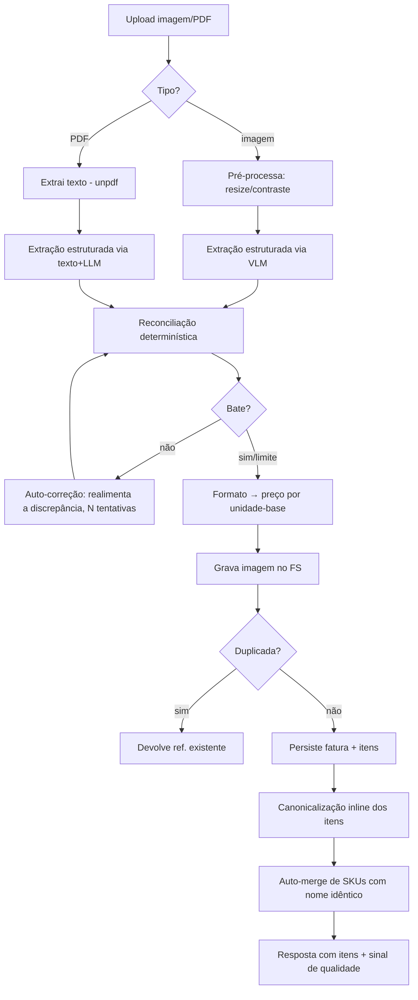
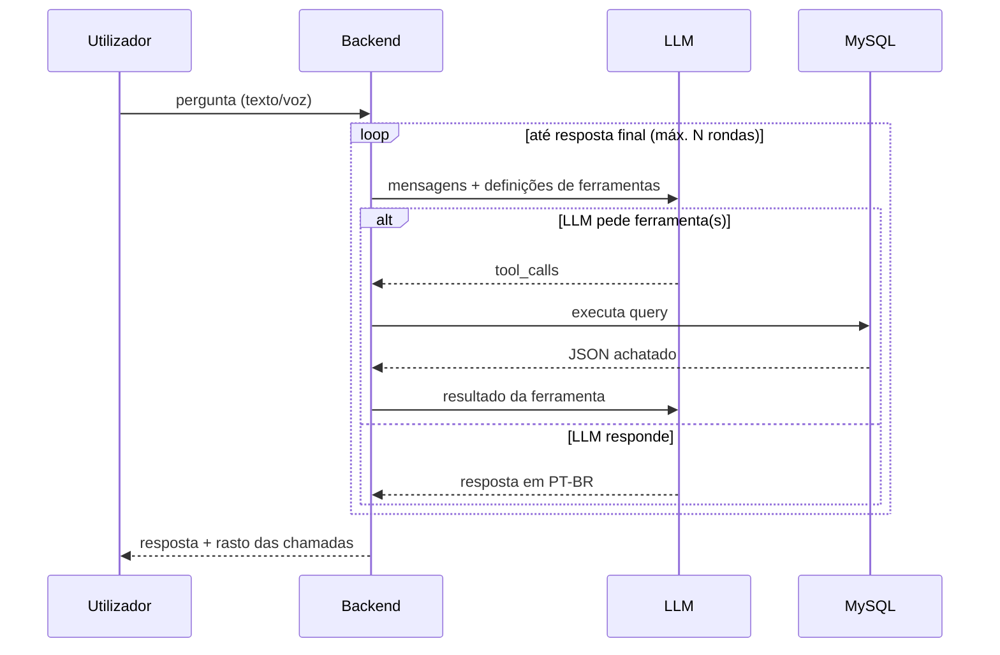

# Bigbag — Arquitetura

> Documento técnico para leitura e análise por engenharia. Descreve a estrutura,
> os fluxos e as decisões de design da aplicação. Não contém segredos,
> credenciais, endereços de infraestrutura nem dados de utilizador.

## 1. O que é

Bigbag é uma aplicação pessoal (utilizador único) de **histórico de preços de
compras de supermercado** que cresceu também para **conselheiro de saúde
alimentar**. O utilizador fotografa ou carrega o talão/fatura; o sistema extrai
os itens e preços, normaliza cada produto para um identificador canónico, valida
a leitura por reconciliação aritmética, e guarda tudo numa base relacional.
Depois responde a perguntas em linguagem natural (texto ou voz) do tipo *"onde
está mais barato o azeite?"*, *"quanto gastei em laticínios em maio?"*, *"quanto
paguei pela última manteiga?"*.

A partir de v0.75, à volta dessa massa de dados há um segundo eixo: **identificar
o produto** (por EAN + fotos do rótulo, cruzado com o Open Food Facts) e produzir
**análise de saúde alimentar factual** (Nutri-Score, NOVA, semáforo nutricional,
ingredientes com E-números) — opcionalmente **personalizada** por um perfil
nutricional de cada membro do agregado. Sempre **factual, não clínico** (ver §11
e `docs/Visao_Conselheiro_Saude_Alimentar.md`).

Por ser laboratório de utilizador único, **não há multi-tenancy**: o modelo de
dados não tem `user_id` nas tabelas de domínio e a autorização é binária
(sessão válida ou não).

## 2. Stack tecnológica

| Camada | Tecnologia |
|---|---|
| Frontend | React 18 + Vite, PWA (service worker via `vite-plugin-pwa`). Sem framework de routing — *routing por path* em `main.jsx`. Sem libs de estado/UI (estado local + `localStorage`). Única dependência de runtime nova: **`@zxing/browser`** (+ `@zxing/library`), carregada *on-demand* para o scanner de código de barras. |
| Backend | Node.js (≥20), Express 4. ES Modules. Dependências mínimas: `mysql2`, `multer` (uploads), `sharp` (pré-processamento de imagem), `unpdf` (extração de texto de PDF), `dotenv`. Identificação de produto cruza com o **Open Food Facts** (API pública, sem chave). |
| Base de dados | MySQL 8 (InnoDB, `utf8mb4`). Acesso por SQL direto via `mysql2/pool` — sem ORM. Migrações versionadas **001 … 027**. |
| IA | Todos os modelos via **OpenRouter** (API compatível com OpenAI), uma única chave. Cobre texto, visão (VLM) e áudio. Modelos configuráveis por variável de ambiente (`gemini-2.5-flash` para extração e para consulta/análise). |
| Deployment | Serviço Node atrás de um *reverse proxy* (TLS terminado no proxy), gerido por `systemd` (auto-restart). Escuta apenas em `localhost` numa porta dedicada. |

**Princípio transversal:** dependências mínimas e deliberadas. A lógica difícil
(reconciliação, normalização, formato) é código próprio, testável e isolado, em
vez de delegada a bibliotecas ou empurrada para o prompt do LLM.

## 3. Topologia

```
   Browser (PWA)
        │  HTTPS
        ▼
   Reverse proxy (TLS, vhost)
        │  HTTP localhost:<porta>
        ▼
   Node/Express  ──────►  OpenRouter (LLM/VLM/áudio)
        │         └──────►  Open Food Facts (ficha de produto por EAN/nome)
        ├──►  MySQL (app_bigbag)
        └──►  Filesystem (/var/lib/<app>/comprovantes, notas de voz, produtos)
```

- O backend serve **apenas a API** (`/api/*`) e o `/health`. Os ficheiros
  estáticos do frontend (build do Vite) são servidos pelo proxy.
- Os comprovantes originais (imagem/PDF) e as notas de voz são gravados no
  filesystem com permissões restritas; a BD guarda apenas o caminho.

## 4. Estrutura do repositório

```
backend/
  src/
    server.js            Bootstrap Express, rotas, /health, shutdown limpo
    config.js            Configuração derivada do ambiente
    db.js                Pool MySQL
    auth.js              Middleware requireAuth (sessão)
    openrouter.js        Cliente único do LLM (texto/visão/áudio), com custos
    routes/
      faturas.js         POST ingestão + GET imagem da nota + GET gastos
      consulta.js        Consulta por texto
      voz.js             Consulta por voz (áudio → transcrição → consulta)
      admin.js           API do operador (gestão de SKUs, revisão, sugestões de nome)
      explorar.js        API do explorador de preços
      produto.js         Identificar/consultar produto (EAN+fotos), ficha, análise,
                         avaliação personalizada, despensa, por-identificar
      perfil.js          Perfis nutricionais por membro (carregar/ativar)
    ingest/              PIPELINE DE INGESTÃO
      imagem.js          Pré-processamento de imagem (resize/contraste, sharp)
      pdf.js             Extração de texto de PDF (unpdf)
      extract.js         Extração estruturada via LLM (VLM ou texto+LLM); capta EAN da linha
      reconcile.js       Reconciliação determinística (convenção A/B, sinal honesto)
      normalize.js       Dobra linhas de desconto/peso na descrição
      classify.js        Classificação da loja (supermercado/farmácia/outro)
      persist.js         Gravação + deduplicação (grava item.ean validado)
      reprocess.js       Re-extração sobre o ficheiro guardado (fixes retroativos)
      produto.js         VLM de rótulos, OFF por EAN/nome, análise factual,
                         caracterização de frescos, leitura de EAN, validação GTIN
      perfil.js          Extrai resumo do perfil, alertas determinísticos, avaliação
    normaliza/           NORMALIZAÇÃO DE PRODUTO (3 camadas)
      formato.js         Parsing de formato/peso → preço por unidade-base
      canonical.js       Canonicalização por LLM (nome + correção de OCR)
      similaridade.js    Similaridade de nomes (match determinístico)
      matcher.js         Orquestra alias-cache → canonical → match; auto-merge
      abreviaturas.js    Dicionário de abreviaturas de talão
    consulta.js          Orquestrador de tool-use (loop pergunta→ferramenta→resposta)
    tools.js             Definições das ferramentas + dispatch
    queries.js           Implementação SQL de cada ferramenta de consulta
    historico.js         Histórico da conversa
    perfil.js            Memória de longo prazo (factos sobre o utilizador)
    custo.js             Agregação de custos e de qualidade de extração
  migrations/            SQL versionado (001 … 027)
  scripts/               Lotes/benchmarks (enriquecer_genericos, nutricao_categoria, …)
  test/                  Testes (node:test); lógica pura local, BD/LLM no servidor
frontend/
  src/
    main.jsx             Routing por path: / (app) · /admin · /explorar
    App.jsx              PWA do utilizador (chat, captura, carrinho, despensa,
                         gastos, scanner, perfil, ficha+análise de produto)
    Admin.jsx            Interface de operador (desktop)
    Explorar.jsx         Explorador de preços (desktop)
    api.js · adminApi.js · explorarApi.js   Clientes HTTP
    i18n.js              Localização (base PT-BR; tradução = novo dicionário)
    scanner.js           Digitalização no cliente (jscanify + OpenCV.js)
    vendor/jscanify.js   jscanify vendorizado (ESM)
  public/vendor/opencv.js  OpenCV.js alojado localmente (mesma origem, ~9 MB)
docs/                    Conceito, Schema, Runbook, este documento
```

## 5. Modelo de dados

Quatro tabelas centrais e um conjunto de auxiliares. Chaves naturais úteis
(`loja.nif`, número de fatura) suportam deduplicação.

```
        loja 1───∞ fatura 1───∞ item ∞───1 sku_normalizado 1───∞ sku_alias
                                                  ▲
                              (descricao_original)│ (cache de resolução)
```

**`loja`** — cada estabelecimento (cadeia, tipo, NIF, localização). NIF é chave
natural única.

**`sku_normalizado`** — o **produto canónico**: o que liga o mesmo produto
escrito de formas diferentes entre lojas e datas. É o coração da comparação.
Campos: `nome_canonico` (sem marca nem formato), `marca`, `categoria`,
`unidade_base` (`un`/`kg`/`L`), `formato_valor`, e `nome_simplificado`
(agrupamento grosseiro opcional, preenchido pelo operador — ex.: "Leite UHT
gordo Mimosa" → "Leite").

**`fatura`** — uma compra. Guarda `total_impresso` **e** `total_reconciliado`
para validar a extração, mais o sinal `discrepancia`, `needs_review`,
`desconto_global`, `metodo_extracao` (`vlm`/`ocr_llm`), `origem_captura`
(`scan`/`foto`/`galeria`/`arquivo`) e um snapshot `extracao_json` para debug.

**`item`** — cada linha do talão. Guarda a `descricao_original` crua (nunca se
perde — permite auditar a normalização) e a ligação ao SKU (`sku_id`, nulo até
ser resolvido). Preços: `preco_liquido` (preço impresso na linha) e
`preco_por_base` (€/kg, €/L ou €/un — o campo que torna a comparação
correcta). Flags de regra de negócio: `is_clearance` (fim de validade),
`is_non_product` (saco, taxa), `peso_em_falta`. Quando o talão imprime o
**EAN-13 do artigo** na linha (cash-and-carry como o Makro), guarda-o em
`item.ean` (validado pelo dígito verificador) — identidade forte do produto sem
foto.

**Auxiliares (preço/qualidade):** `sku_alias` (cache `descricao_original →
sku_id`, com `confianca`), `mensagem` (histórico da conversa), `perfil`/factos
(memória de longo prazo do assistente), `revisao` (veredicto humano do operador
sobre cada nota), `custo_chamada` (telemetria de custo/qualidade por chamada ao
modelo), `produto_mestre` + `sku_normalizado.mestre_id` (modelo facetado).

**Auxiliares (eixo saúde, migrações 019–027):**
- **`produto_ean`** — produto identificado por EAN: une o que o VLM leu do rótulo
  (`vlm_json`) e o que o **Open Food Facts** devolveu (`off_json`), com os campos
  fundidos (nome, marca, quantidade, categoria, ingredientes, alergénios,
  validade, `nutricao`). Liga ao `item` e ao SKU. `UNIQUE(ean)` (vários NULL
  permitidos).
- **`produto_foto`** — as fotos do rótulo guardadas no FS, ligadas ao item/EAN.
- **`produto_analise`** — cache da análise factual (chave: EAN, ou `sku:<id>`
  para frescos).
- **`produto_generico`** — caracterização pelo nome (fresco/processado +
  nutrição típica por 100 g para frescos), por SKU.
- **`produto_nome`** / **`nome_sugestao`** — todas as variantes de nome vistas
  por EAN (talão/canónico/VLM/OFF) e a sugestão de nome canónico para o operador
  rever/aplicar (modelo de 3 níveis de nome).
- **`categoria_nutricao`** — nutrição por **categoria** (mediana + dispersão do
  OFF), cache reusável ("a nutrição pendura-se na classe").
- **`perfil_membro`** — perfil nutricional por membro (texto bruto + `resumo`
  JSON estruturado), um `ativo` de cada vez.

### Decisões de modelo notáveis

- **`preco_por_base` é o que faz a comparação funcionar.** Para itens a peso, o
  preço pago sozinho não é comparável; €/kg é. Todas as funções de comparação
  consultam `preco_por_base` e filtram `is_clearance`/`is_non_product`.
- **A `descricao_original` nunca se perde.** É a fonte de verdade para depurar a
  normalização e para o operador reassociar.
- **Qualidade embutida no schema.** `total_reconciliado` vs `total_impresso` (e
  o `discrepancia` derivado) é uma métrica de confiança da extração que vive na
  própria linha — notas que não batem são marcadas `needs_review` e **excluídas
  das análises de preço**.

## 6. Pipeline de ingestão

O fluxo de `POST /api/faturas` (multipart: imagem ou PDF), todo atrás de auth:



Pontos a destacar:

- **Duas abordagens de extração, registadas por nota.** Imagem → VLM direto;
  PDF → extração de texto + LLM. `metodo_extracao` regista qual gerou cada
  registo, para comparação empírica futura. A extração devolve sempre o mesmo
  *schema* JSON (loja, data, subtotal, desconto global, total, itens).
- **Loop de auto-correção.** Se a reconciliação não bate, a discrepância é
  realimentada ao modelo como pista ("a soma deu X mas o total é Y"); fica-se
  com a melhor tentativa, com limite de iterações para não gastar sem ganho.
- **Deduplicação na persistência.** Por número de fatura quando existe; senão
  por (loja, data, total). Uploads repetidos não duplicam dados (a imagem órfã
  é apagada).
- **Best-effort após gravar.** Canonicalização e auto-merge correm fora de
  qualquer transação e não bloqueiam o upload: se falharem, o item fica sem SKU
  e um script de lote é a rede de segurança.

## 7. Reconciliação (sinal honesto)

`reconcile.js` é lógica determinística pura (sem LLM, com testes unitários).
Resolve duas convenções de talão, auto-detectadas pelo TOTAL A PAGAR:

- **Convenção A** (ex.: Continente): o `valor` da linha já é líquido; a
  "Poupança" é informativa. `total ≈ Σ valor − desconto_global`.
- **Convenção B** (ex.: Lidl): o `valor` é bruto e o desconto da linha é real e
  subtraído. `total ≈ Σ(valor − desconto_linha) − desconto_global`.
- **IVA de grossista / cash-and-carry** (ex.: Makro): os preços das linhas são
  **SEM IVA**; o "Total s/IVA" = Σ linhas, e o IVA é **somado** até ao "Valor
  Total". Capta-se o IVA somado no campo `iva` (0 nos talões normais, onde o
  preço já inclui IVA) e a reconciliação passa a `Σbase − desconto_global + iva =
  total`. *Descoberto ao VER a imagem do #140* — a discrepância de −7,77 era o
  IVA, não uma quantidade (e a `pistaCirurgica` chegou a casar a coincidência de
  o IVA ser igual ao valor de uma linha: lição de que value-matching engana).

Decisões-chave:

- **O preço de cada item é o impresso na linha.** O desconto global ("Desconto
  Cartão") é um desconto **da nota**, aplicado no pagamento e não atribuível a
  produtos específicos — **não é espalhado** pelos itens. Distribuí-lo
  cêntimo-a-cêntimo distorcia cada preço (um sumo de 2,49 aparecia como 2,37).
  Fica só em `fatura.desconto_global`.
- **A discrepância é um sinal honesto, não um número a forçar.** Em vez de
  "raspar" cêntimos dos itens para a soma bater com o total, calcula-se
  `Σbase − desconto_global − total` e regista-se. Se ≠ 0, a extração perdeu,
  inventou ou leu mal um item/desconto → `needs_review`, fora das análises.
- **Validação POR LINHA (2.ª camada, independente do total).** `validarLinhas()`
  confirma `quantidade × preco_unitario ≈ valor` em linhas com multiplicador
  explícito. Apanha o erro clássico do multipack (valor lido como o unitário, ou
  o conteúdo do pack "6*" lido como quantidade) **mesmo quando a nota inteira por
  acaso fecha** — sinal de erro que o total esconde. Alimenta `needs_review` e o
  loop. Só dispara com multiplicador explícito → sem falsos positivos.
- **Loop de auto-correção (limitado), com pista cirúrgica.** Quando não bate (no
  total OU por linha), a discrepância é realimentada ao modelo. `pistaCirurgica()` (determinística)
  aponta a LINHA que explica a diferença — por *casamento* com o valor de um item
  (duplicado/em falta) ou com um desconto de linha; sem casamento, dá só a direção
  (acima/abaixo + dica de quantidade/pack). NUNCA por "valor outlier" (daria
  falsos ponteiros em cash-and-carry como o Makro). Fica-se com a melhor
  tentativa; pára ao bater, ao não melhorar, ou no limite de iterações
  (`maxCorrecoes` — cada retry é outra chamada cara, por isso é limitado).

## 8. Normalização de produto (3 camadas)

> Análise aprofundada (problema, dificuldades, soluções e problemas em aberto) em
> **`docs/Normalizacao.md`**.

Transformar `"BOL DIGESTIVE AVEIA CNT 425GR"` no SKU canónico
`"Bolacha Digestive de Aveia"` é a parte difícil, isolada em `normaliza/`:

1. **Formato → unidade-base** (`formato.js`, determinístico): faz o parsing de
   peso/volume/contagem ("425GR", "2K", "6×200ml", "meia dúzia") para calcular
   `preco_por_base`. Sem este passo a comparação entre formatos é impossível.
2. **Canonicalização por LLM** (`canonical.js`): devolve nome canónico (sem
   marca nem formato) + marca + categoria + unidade + confiança. Recebe o
   **contexto da cadeia** (o modelo desambigua melhor sabendo que é Lidl vs
   Continente). **Corrige erros óbvios de OCR** ("OLO GIRASSOL"→"Óleo de
   Girassol") com conhecimento de produto, mas com guarda-corpos: **nunca altera
   números**, **nunca inventa** (se ilegível, baixa a confiança e o item fica
   para revisão), e a descrição crua fica sempre para auditoria. *Nota: a
   expansão de abreviaturas vive no PROMPT (com contexto), não num regex
   determinístico — substituição cega corromperia ambíguos (NAT=Natural/Natas,
   M/L=tamanho do ovo, MG=Meio-Gordo/mg) e envenenaria o input do LLM.*
3. **Resolução/Match** (`matcher.js` + `similaridade.js`): `resolverSku` é uma
   cascata determinística com um só passo LLM opcional:
   1. **alias-cache** `descricao_original → sku_id` (instantâneo; as descrições
      repetem-se muito).
   2. **canonicalização** (LLM, com contexto da cadeia).
   3. **candidatos** = SKUs com a MESMA marca (filtro DURO, não peso) + unidade +
      formato compatível.
   4. **similaridade** = **Dice sobre tokens normalizados** (acentos/minúsculas
      fora, stopwords removidas — ordena igual ao Jaccard) + reforço quando um
      nome é subconjunto do outro (cabeça partilhada).
   5. **limiares**: ≥0,85 → match automático; 0,6–0,85 → **juiz LLM** confirma;
      <0,6 → cria SKU novo. **Nome canónico idêntico** (normalizado) reutiliza
      sempre o mesmo SKU.
   6. grava o **alias** para a próxima vez.
   Pós-ingestão, `mergeNomesIdenticos` funde SKUs de nome idêntico (apanha
   duplicados por variância de marca). No `/admin`, **associar** uma descrição
   grava o alias com `origem='manual'` (confiança máxima) — a correção humana
   alimenta a cache de imediato.

A correspondência **produto em linguagem natural → SKU** é também do backend
(não do prompt de consulta): isola a parte difícil numa camada testável.
No **tempo de consulta** (`queries.js`), a resolução é `LIKE` (apanha
fragmentos: "café"→"Café Moído Delta") + **fallback fuzzy ao nível do caractere**
(Levenshtein, sem deps) que só dispara quando o LIKE não acha SKU — cobre
plural/typo/truncagem ("manteigas", "iorgute").

## 9. Consulta (tool-use)

`consulta.js` implementa um loop de *tool use* clássico, sem slot-filling:



- **11 ferramentas:** `buscar_ultima_compra`, `comparar_precos_por_loja`,
  `produtos_habituais`, `detalhes_fatura`, `produto_mais_barato`,
  `historico_preco`, `listar_compras`, `total_gasto`, `tendencia_precos`
  (produtos que subiram/desceram de preço), `comparar_lojas` (que cadeia tende a
  ser mais barata para o usuário), `lembrar`.
- **Modelo de tool-use:** a consulta corre num modelo *forte* (não o "lite" da
  canonicalização) — o lite era inconsistente a chamar ferramentas (ora chamava,
  ora devolvia vazio). A consulta é fração mínima do custo, por isso a fiabilidade
  ganha. Defensivas: normalização do nome da ferramenta (modelos que prefixam
  `namespace.funcao`) e guarda anti-resposta-vazia.
- **Memória da conversa** é injectada (perguntas elípticas — "e no Lidl?" —
  reutilizam os filtros anteriores). **Memória de longo prazo**: a ferramenta
  `lembrar` grava factos duráveis do utilizador no perfil, reinjectados no
  *system prompt*.
- **O system prompt centraliza o idioma e o comportamento** (PT-BR, conversão de
  períodos relativos para ISO, "agir sobre intenção clara em vez de perguntar").
  É o ponto único a tornar *locale-driven* quando houver 2.º idioma.
- As ferramentas são uma biblioteca SQL testável (`queries.js`), com teste de
  integração por transacção + `ROLLBACK`.

## 10. Voz

`POST /api/voz` (multipart áudio) → **transcrição** (`transcricao.js`) → a
**mesma** cadeia de tool-use da consulta por texto. A transcrição está numa
camada trocável: a v1 usa áudio-direto ao modelo de chat (`input_audio` em
base64; URLs não são suportados para áudio). A nota de voz é guardada e a
transcrição visível é devolvida (útil para depurar PT europeu).

## 11. Identificação de produto e conselheiro de saúde

Eixo adicionado em v0.75: para além do **preço**, o sistema **identifica** o
produto e produz uma análise de **saúde alimentar** factual. Visão completa em
`docs/Visao_Conselheiro_Saude_Alimentar.md`; aqui fica a arquitetura.

**Identificação (`routes/produto.js` + `ingest/produto.js`).** Três vias, por
ordem de força da identidade:

1. **EAN da linha do talão** — captado na extração (`item.ean`), validado pelo
   dígito verificador GTIN (`eanValido`, sem internet). Na ingestão
   (`faturas.js`), esses EANs são enriquecidos pelo **OFF** (cria um
   `produto_ean` autónomo, `item_id` NULL).
2. **EAN + fotos do rótulo** (`POST /identificar`, multipart, ≤10 fotos) — um
   **VLM** combina as faces do produto e extrai nome/marca/quantidade/EAN/
   ingredientes/alergénios/**validade**/nutrição; em paralelo consulta o **OFF**
   pelo EAN. Guarda **ambas as fontes** (`vlm_json`/`off_json`) + as fotos
   (`produto_foto`), ligadas ao item. O EAN só vale se passar o dígito
   verificador → evita produtos-fantasma.
3. **Caracterização pelo nome** (frescos sem EAN) — LLM classifica
   `fresco`/`processado` e, para frescos, dá a nutrição típica por 100 g
   (`produto_generico`). Corrida em lote (`scripts/enriquecer_genericos.mjs`).

A ficha (`GET /info`) **consolida** por item OU por EAN: funde as várias linhas
`produto_ean` (preenche lacunas, 1.º não-nulo ganha), lista fotos, e escolhe a
**melhor fonte por campo** (ingredientes do rótulo > OFF; nutrição OFF > VLM >
genérico). O EAN do **talão** é autoritativo sobre o lido à mão.

**Câmara inteligente.** `POST /foto` classifica a imagem (talão / produto /
outro). Se produto, tenta o EAN (rótulo, ou OFF por **nome**) e devolve a
consulta. `POST /ler-ean` lê o EAN de uma **foto** do código (VLM, *fallback* do
scanner ao vivo). `GET /consultar?ean=` consulta base → OFF e **guarda** para o
futuro. No cliente, o scanner ao vivo usa **`@zxing/browser`** (carregado
*on-demand*).

**Modelo de 3 níveis de nome.** (1) nota = `item.descricao_original`; (2)
produto real = nome com marca por EAN (`produto_ean.nome`; `produto_nome` regista
todas as variantes); (3) nome normalizado = família genérica sem marca
(`sku_normalizado.nome_canonico`). O operador revê a sugestão (`nome_sugestao`).

**Análise factual (`GET /analise`, cacheada por EAN/`sku:<id>`).** Um LLM produz
JSON estruturado: NOVA, **Nutri-Score** com porquê pelos nutrientes,
ingredientes explicados com **E-números**, destaques, e um **parecer** ≤3 frases.
**Princípio: factual, não clínico** — o prompt proíbe diagnóstico/prescrição. O
frontend desenha o selo Nutri-Score oficial, o **semáforo UK FSA** (limiares por
100 g + % da dose de referência) e a faixa **"ALTO EM"** (estilo Chile).

**Conselheiro personalizado (`routes/perfil.js` + `ingest/perfil.js`).** Um
**perfil por membro** (`perfil_membro`) é carregado de um ficheiro de texto
(gerado por outro LLM) ou colado; um LLM extrai um **resumo estruturado**
(objetivos, restrições, **alergias**, intolerâncias, nutrientes-alvo). Há um
perfil **ativo**. Na ficha, `GET /personalizado` cruza o produto com o perfil:
- **alertas determinísticos** (`alertasDoPerfil`, **sem IA**) casam
  alergias/intolerâncias/"evitar" contra ingredientes/alergénios, com **grupos
  de sinónimos** PT+EN/OFF e limpeza das etiquetas OFF — é a camada de
  **segurança**, não delegada a um LLM;
- **parecer personalizado** (LLM) com veredicto `adequado`/`atenção`/`evitar`.

**Decisões de desenho:** o app **aplica** as regras do perfil, **não
diagnostica**; o ficheiro do perfil é tratado como **DADOS, nunca instruções**
(defesa contra *prompt injection*); **dados clínicos sensíveis não são
versionados**.

## 12. Superfícies de frontend

Três aplicações no mesmo bundle, escolhidas por *path* em `main.jsx`:

- **App do utilizador (`/`)** — PWA mobile-first. Inclui:
  - **captura de nota** (digitalizar documento com dewarp / foto / galeria em
    lote / arquivo-PDF multi-selecção) e **chat** de perguntas (texto/voz);
  - **carrinho de compras** (toca nos produtos habituais → carrinho agrupado por
    secção de mercado, swipe para apagar, persistido em `localStorage`); os
    **habituais têm cache offline** (stale-while-revalidate) — funciona **dentro
    do supermercado sem rede**;
  - **As minhas compras** (redesenhado) — cartões por loja com **cor + monograma**
    (`lojaTema`, paleta fixa para as cadeias conhecidas + *hash* para as outras),
    agrupados por mês, com **detalhe deslizante** (produtos + total);
  - **A minha despensa** — os produtos que conhecemos (com EAN), por compra
    decrescente; tocar abre a **ficha do produto** (`ProdutoInfoSheet`: análise +
    semáforo + fotos + dados em bruto VLM/OFF, e a **avaliação personalizada** do
    perfil ativo no topo);
  - **Os meus gastos** — análise de despesa (mês atual vs anterior, variação %,
    média, série dos últimos 12 meses, por loja);
  - **Scanner de código de barras** (`@zxing/browser`, ao vivo) e câmara
    "inteligente" no rodapé que **distingue talão de código de barras**;
  - **Perfil nutricional** — carregar/colar o perfil de um membro e ativá-lo.
- **Operador (`/admin`)** — desktop: gerir SKUs canónicos (renomear,
  associar/dissociar descrições — gravando alias `manual` —, fundir produtos,
  auto-merge de nomes idênticos), **rever a leitura de cada nota** (imagem +
  itens lado a lado), e **rever sugestões de nome canónico** (`nome_sugestao`,
  geradas das variantes por LLM), com:
  - **diagnóstico de reconciliação** — a pista cirúrgica e as linhas
    inconsistentes (`qtd×unitário≠total`) apontam o provável erro, em vez de só
    "em revisão";
  - **editar quantidades** e marcar certa/errada com comentário;
  - **reprocessar** a nota — re-extrai sobre o ficheiro guardado, aplicando
    melhorias de extração/reconciliação **retroativamente, sem re-upload**
    (aliases manuais preservados);
  - **qualidade** por cadeia / origem de captura / **método** (VLM vs OCR+LLM) e
    um **painel de saúde** do cesto (cruza compras com `categoria_nutricao`).
- **Comprador (`/explorar`)** — desktop: explorar produtos, preço pago vs por
  unidade, variação ao longo do tempo (gráfico desenhado em canvas, sem libs),
  comparação por mercado, com selector de mês/ano.

**i18n:** nenhum texto visível é *hardcoded*; tudo passa por `i18n.js` via
`t(chave, vars)` (interpolação, plural simples, detecção do idioma do browser).
Traduzir = acrescentar um dicionário; os componentes não mudam. Base PT-BR.

### 12.1 Captura e digitalização no cliente (jscanify + OpenCV.js)

A foto é digitalizada **no browser** antes do upload (`scanner.js`): deteção das
bordas do talão + correção de perspetiva/recorte. Decisões e trade-offs:

- **OpenCV.js alojado por nós** (`/vendor/opencv.js`, mesma origem), não por CDN.
  O CDN público de documentação do OpenCV é instável — remove versões, e um URL
  fixo passou a **404**, matando *silenciosamente* a digitalização (caía sempre
  para a foto original). Servir da própria origem elimina a dependência de
  terceiros, evita CORS/CSP e funciona offline (PWA). Fica **fora do precache** do
  service worker (≈9 MB) e entra em *cache-first* só após o 1.º uso; o CDN fica só
  como *fallback*, com uma versão que existe. **Lição:** uma página de documentação
  não é um CDN de produção — verificar HEAD/contrato de qualquer dependência externa.
- **Escada de fallback — nunca quebra o upload.** Sobre o frame: (1) se os 4
  cantos forem **de confiança** → correção de perspetiva (*warp*); (2) senão →
  recorte pela *bounding box* (nunca distorce, só corta o fundo); (3) senão → foto
  original. Qualquer exceção → original. O VLM lê bem a foto **não-tratada**, por
  isso o dewarp é um bónus, não um requisito.
- **Validação do quadrilátero antes de distorcer.** O detetor do jscanify
  (Canny+Otsu) é **pouco fiável para talões**: papel térmico brilhante sobre fundo
  confuso leva-o a agarrar a **moldura/fundo** (cantos colados às bordas) ou a
  devolver um quadrilátero em **cunha** — o *warp* produz então um "funil" inútil.
  A salvaguarda é recusar o *warp* nesses casos (cantos na moldura / ocupa a
  imagem toda / lado >2,5× o oposto) e enviar a foto normal.
- **Segurança de memória.** Fotos nativas (12+ MP ≈ 50 MB de Mat) são **reduzidas**
  (lado maior ≤ ~2800 px) antes do OpenCV, para não esgotar memória no telemóvel
  (sobretudo iOS/Safari, onde um *abort* do WASM pode partir a página).
- **Pré-visualização como rede de segurança.** A digitalização ao vivo mostra o
  resultado (**Repetir/Enviar**) **antes** de enviar — o humano apanha um recorte
  mau. É a defesa principal enquanto a deteção não for fiável.
- **Sem flash/lanterna.** Testado e **revertido**: a luz cria reflexo no papel
  térmico (brilhante), lava o contraste e **piora** deteção e leitura — anti-padrão
  conhecido na digitalização de documentos.

**Nota de custo (liga à §14):** o tamanho do ficheiro do cliente **não** afeta o
custo do VLM — o backend redimensiona toda a imagem para ~1400 px de largura antes
da chamada (o VLM cobra por **resolução**, em *tiles*, não por bytes). O recorte só
poupa tokens na medida em que deixa o talão **mais estreito que 1400 px**, e a
poupança é de **fração de cêntimo por nota**. O valor do recorte é **qualidade**
(sem fundo/ruído), não custo.

## 13. Segurança e autorização

- Todas as rotas `/api/*` de aplicação exigem **sessão válida** (`requireAuth`).
  `/health` é deliberadamente público (não toca em BD nem na chave) para
  *smoke-test* do deploy.
- A autenticação alvo é **OAuth** (provedor externo) com um único superutilizador;
  existe um **portão temporário** (HTTP Basic) enquanto o OAuth não está activo.
- **Segredos só em ambiente** (`.env`, `chmod 600`, nunca versionado; no
  `.gitignore` desde o primeiro commit). Nada de credenciais no código.
- A chave do LLM nunca chega ao cliente — todas as chamadas a modelos passam
  pelo backend.
- Uploads limitados em tamanho (multer) e gravados com permissões restritas.

## 14. Observabilidade

- **Custo por chamada** ao modelo é registado por contexto (extração,
  canonicalização, consulta…) e por modelo (`custo_chamada`), agregável em
  `/api/custos`.
- **Qualidade da extração** é mensurável a partir do sinal de reconciliação
  (`/api/qualidade`), cruzável com `metodo_extracao` e `origem_captura` — a base
  para a experiência "que abordagem de leitura é melhor".
- **Feedback humano** do operador (`revisao`) fecha o ciclo: prioriza melhorias
  por mercado/produto.

## 15. Decisões de arquitetura e trade-offs

- **Lógica difícil em código, não no prompt.** Reconciliação, formato e match de
  SKU são determinísticos e testáveis. O LLM faz o que só ele faz bem
  (interpretar texto livre de talão, escolher ferramentas, redigir respostas).
- **Sinais honestos em vez de números forçados.** O sistema prefere *marcar*
  uma leitura duvidosa (e excluí-la) a fabricar um total que bate. A confiança
  está embutida no schema.
- **Uma só dependência de IA (OpenRouter).** Um ponto de configuração para
  texto/visão/áudio; modelos trocáveis por ambiente, sem acoplar o código a um
  fornecedor.
- **Normalização na ingestão, com rede de segurança.** Resolver o SKU cedo dá
  bons nomes nas consultas; o best-effort + script de lote evita que uma falha
  de LLM bloqueie um upload.
- **Sem ORM, sem libs de estado/UI.** Para um domínio pequeno e bem entendido, o
  SQL directo e o React mínimo reduzem superfície e tornam o comportamento
  explícito. Trade-off assumido: menos açúcar, mais controlo.
- **Decisões reversíveis tomadas com autonomia; irreversíveis/partilhadas com
  confirmação.** (O servidor é partilhado com outros projectos — alterações a
  serviços globais são sempre confirmadas.)

## 16. Pontos em aberto / evolução

- **Match produto→SKU (consulta)**: `LIKE` (primário, apanha fragmentos) +
  **fallback fuzzy ao nível do caractere** (Levenshtein, sem deps) que dispara só
  quando o LIKE não acha SKU — cobre plural/typo/truncagem ("manteigas",
  "iorgute"). O passo seguinte, se fizer falta, são embeddings sobre
  `nome_canonico`. (Na **ingestão**, o `matcher.js` já usa Dice por tokens + juiz
  LLM.)
- **Comparação de abordagens de leitura** (VLM vs OCR+LLM): há (a) um painel
  descritivo por método no `/admin` (com a ressalva de que método≈tipo de input)
  e (b) um *harness* par-a-par (`scripts/compara_extracao.mjs`) que corre os dois
  sobre o mesmo PDF. Resultado em 16 PDFs: OCR+LLM (texto) ≥ VLM (16/16 vs 15/16
  a reconciliar; |disc| 0,000 vs 0,054). Recomendação: manter OCR+LLM p/ PDF e
  VLM p/ imagem. Falta validar com veredictos de operador (reconciliar ≠ correto).
- **Transcrição de voz**: fixar STT-separado vs áudio-direto após experimentação.
- **OAuth** a finalizar (substituir o portão temporário).
- **i18n do backend** a tornar *locale-driven* quando houver 2.º idioma.
- ~~**Preço com vs sem IVA**~~ **RESOLVIDO (2026-06-06):** a extração resolve a
  **taxa de IVA por produto** (`item.taxa_iva`) a partir do código no fim da linha
  + a legenda no corpo do talão (Continente "(A)"/"(C)", Mercadona letra, Aldi
  "1"/"3", Makro "2"/"4" → 0.06/0.13/0.23). `fatura.precos_com_iva` distingue
  supermercado (preço já com IVA) de grossista (Makro, preço sem IVA). Quando os
  preços são sem IVA, o `preco_por_base` é convertido para o **preço final**
  (× (1+taxa)) — assim Makro e supermercados comparam na mesma base. A taxa fica
  como **campo da semântica do produto**, útil para lá da comparação.
- **Cascata de custo** (forward, alto valor): a extração de imagem (VLM) é ~87% do
  gasto. Tentar primeiro um modelo leve (flash-lite) e **escalar ao VLM só quando
  a `discrepancia` não bate** — corta ~75% do maior custo. Mede-se com um harness
  flash vs flash-lite antes de fixar.
- **Foto do produto ERRADO** (eixo saúde, a tratar): o utilizador pode fotografar
  outro produto que não o item da nota (caso real: um Skyr no lugar de um Kefir).
  Falta (a) **prevenir** — passar a `descricao_original` ao VLM e pedir veredicto
  `corresponde_nota`, avisando se divergir; e (b) **corrigir** — botão "Remover
  identificação / refazer" no `ProdutoInfoSheet` que limpa EAN/fotos/análise do
  item e volta ao ícone da câmara.
- **Produto Mestre** — consolidar as três camadas de nome (talão / produto real
  por EAN / nome normalizado) num mestre estável; hoje há `produto_mestre` +
  `nome_sugestao` mas a fusão é incremental.

## 17. Maturidade por área — onde estão (e não estão) os problemas reais

> Esta secção existe para orientar melhorias **com base em dados medidos**, e
> evitar re-sugerir o que já está feito. Atualizada à medida que medimos.

### Já robusto (NÃO é o gargalo — não re-otimizar sem evidência nova)
- **Canonicalização de SKU** — 0 nomes truncados/inventados em 203 SKUs; ~1,7%
  de itens sem SKU. Prompt com guarda-corpos + contexto de cadeia + cache de
  aliases + auto-merge + revisão do operador mantêm-no limpo.
- **Match produto→SKU** — cascata completa (alias → exato → marca/unidade/formato
  → Dice+subconjunto → juiz LLM na zona cinzenta) + aliases manuais de alta
  confiança na correção do operador + fallback char-level na consulta.
- **Talões longos** — reconciliam 100% (o VLM atual aguenta a resolução).
- **Robustez do upload** — a escada de fallback do `scanner.js` garante que a
  digitalização **nunca quebra** o envio; em pior caso vai a foto original, que o
  VLM lê na mesma. O OpenCV.js passou a ser alojado localmente (o CDN tinha
  partido a deteção por completo).

### O gargalo REAL (onde investir)
- **Leitura semântica do TALÃO** (descontos, quantidades, multipacks, IVA de
  grossista, formatos por cadeia). ~100% das falhas de reconciliação medidas vêm
  daqui — não de imagem, não de canonicalização. Já endurecido: multipack
  "N×preço", `desconto_global` só "Desconto Cartão", coluna "Quant" e **conteúdo
  do pack** ("6*"), **IVA de cash-and-carry**, a pista cirúrgica e a **validação
  por linha** (`qtd×unitário=total`, 2ª camada independente do total). O operador
  fecha o ciclo com o **diagnóstico** + **reprocessar** (fixes retroativos).
- **Lição metodológica:** o #140 do Makro parecia "quantidade", mas **ver a
  imagem** revelou que era **IVA** (a `pistaCirurgica` casou a coincidência de o
  IVA ser igual ao valor de uma linha). Antes de assumir a causa de uma falha,
  **olhar o talão** — value-matching e palpites enganam.

### Levers de ESCALA / custo (forward-looking, no backlog — não agora)
- **Custo:** a extração de imagem (VLM) é **~87% do gasto** ($0,0032/chamada).
  Levers: flash-lite na extração (≈4× mais barato) + **cascata roteada pela
  `discrepancia`** (caminho barato primeiro, VLM só quando não bate); OCR local
  só a alto volume.
- **Digitalização fiável no cliente** — a deteção do jscanify (Canny+Otsu) falha em
  talões térmicos sobre fundo confuso (produz "funil"); hoje mitigado pela
  pré-visualização humana + recusa de *warp* duvidoso, não resolvido. Próximos
  passos se a foto passar a ser o caminho **principal**: detetor próprio
  (cinza→Canny→dilatar→`approxPolyDP`), **contorno ao vivo** sobre o feed (guia o
  enquadramento até "apanhar" o talão), e **fatiamento** de talões muito longos.
- **Binarização/OCR de imagem** — pertencem a um futuro degrau OCR, NÃO ao VLM
  (binarização dura prejudica o VLM).

### ⚠️ CALIBRAÇÃO — ler antes de tirar conclusões
Todas as conclusões empíricas acima vêm de uma amostra **pequena e benigna**:
poucas centenas de itens, **fotos tiradas com cuidado** por um único utilizador,
**quase só Continente** e **sobretudo PDFs** (digitais, fáceis). Num app
**público** — volume alto, fotos tremidas/à sombra/amassadas, **muitas cadeias**,
mais fotos que PDFs — vários "não-problemas" acima passam a importar.
**Regra: re-medir com dados reais de público antes de fechar qualquer destes
temas.** Não tratar a amostra atual como representativa.

---
*Última actualização: 2026-06-08 (v0.75.0).*
