# BigBag — Catálogo visual das telas (app do utilizador)

*Capturas reais em viewport de telemóvel (iPhone 13, 390×844) da app em produção `bigbag.hal9klabs.com`, v0.0.153.0, com a conta do dono (perfil "Sue" ativo). Geradas por Playwright (`tmp_ui/cap*.mjs`). Objetivo: documentação sólida da UI + base para o **designer** propor melhorias.*

> **Três superfícies** (routing por path): **`/`** app do utilizador (este doc), **`/admin`** operador (desktop), **`/explorar`** comprador (desktop). Aqui só a app do utilizador — a PWA mobile-first.

A app é um **chat** com uma **barra de ações inferior** e ícones de topo que abrem **sheets** (folhas deslizantes). Tudo o que segue são sheets sobre a tela principal.

---

## 1. Principal (chat) · `01_principal.png`
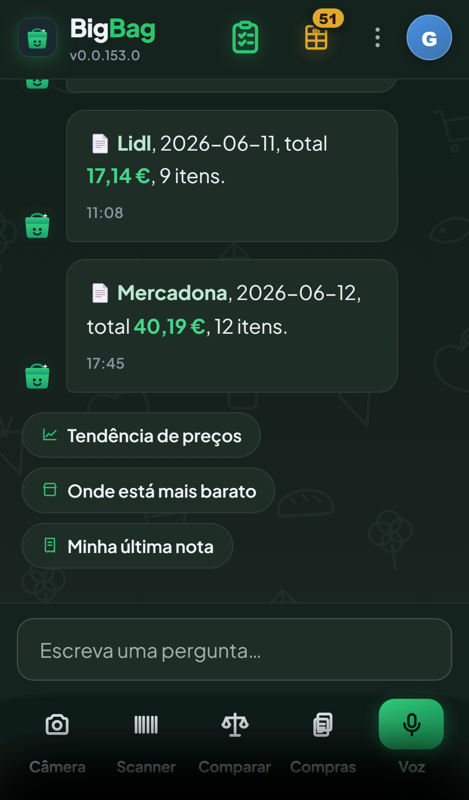

O ecrã-casa. Topo: marca + versão · ícone **lista** (verde) · ícone **despensa** (âmbar, com pílula de contagem) · kebab (⋮) · avatar. Corpo: histórico de conversa estilo WhatsApp — cada talão lido vira uma "bolha" (loja, data, total, nº itens). **Chips de sugestão** ("Tendência de preços", "Onde está mais barato", "Minha última nota"). Barra de input "Escreva uma pergunta…". **Tab bar inferior:** Câmara · Scanner · Comparar · Compras · **Voz** (destaque verde).

## 2. Lista de compras (vazia) · `02_lista.png`
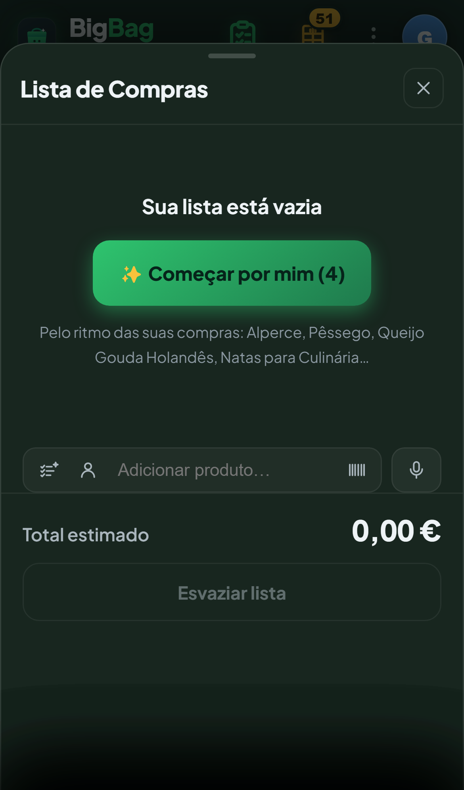
Estado vazio com call-to-action **"✨ Começar por mim (4)"** (pré-preenche pelo ritmo de compra). Linha de adição (ordenar · pessoal · campo "Adicionar produto…" · scan · voz). **Total estimado** + "Esvaziar lista". *(Com itens, agrupa por secção — ver o formato na despensa, idêntico.)*

## 3. Despensa · `03_despensa.png`
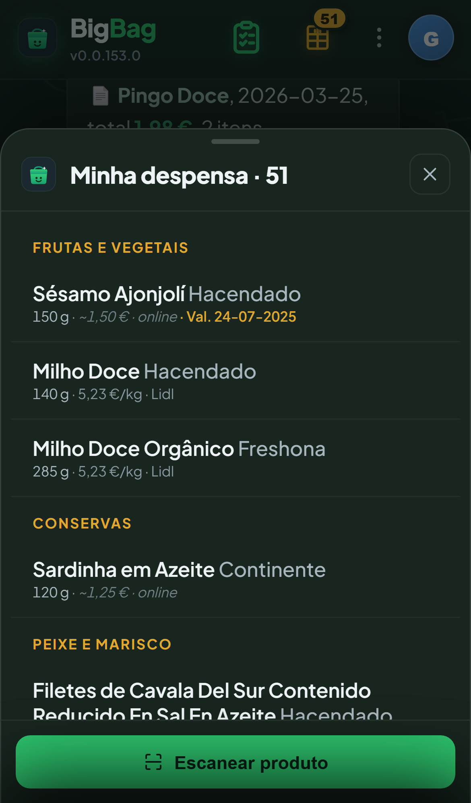
"Tenho em casa" — lista paralela e independente da de compras. Título com contagem (**· 51**). Secções em **âmbar** (FRUTAS E VEGETAIS, CONSERVAS, PEIXE E MARISCO…). Cada item: **nome** + **marca** (cinza) + linha de baixo `tamanho · €preço · online/estimado · Val. data` (validade em âmbar). Remover = **swipe**; tocar = ficha. Rodapé: **"Escanear produto"** (entrada única da despensa).

## 4. Menu (kebab ⋮) · `04_menu.png`
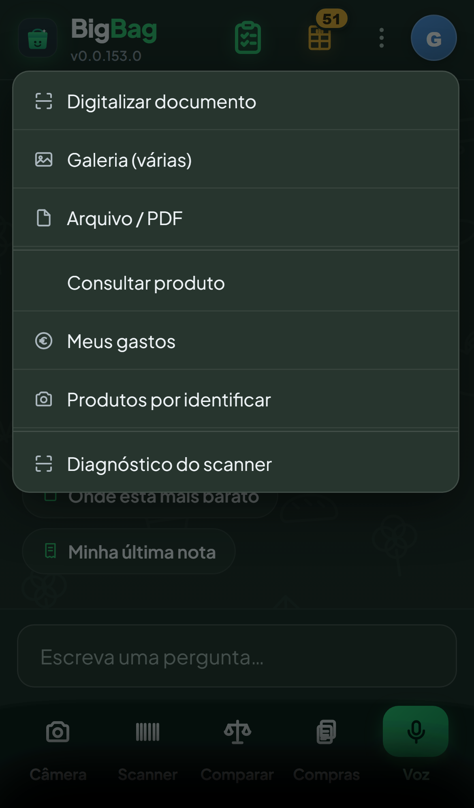
Captura: Digitalizar documento · Galeria (várias) · Arquivo/PDF — separador — Consultar produto · Meus gastos · Produtos por identificar · Diagnóstico do scanner.

## 5. Meus gastos · `05_gastos.png`
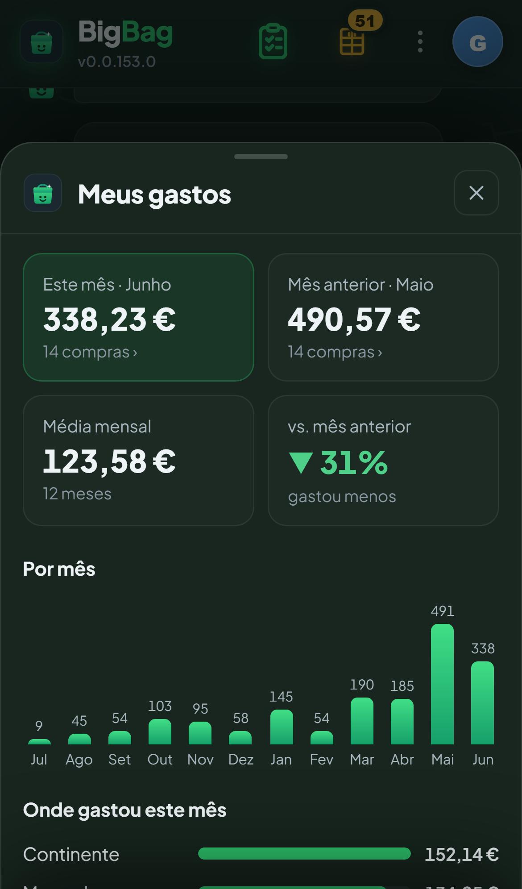
Cards: Este mês (Junho 338,23 €) · Mês anterior (Maio) · Média mensal · variação (▼31% gastou menos). Gráfico de barras por mês. "Onde gastou este mês" (barras por loja).

## 6. Conta (avatar) · `06_conta.png`
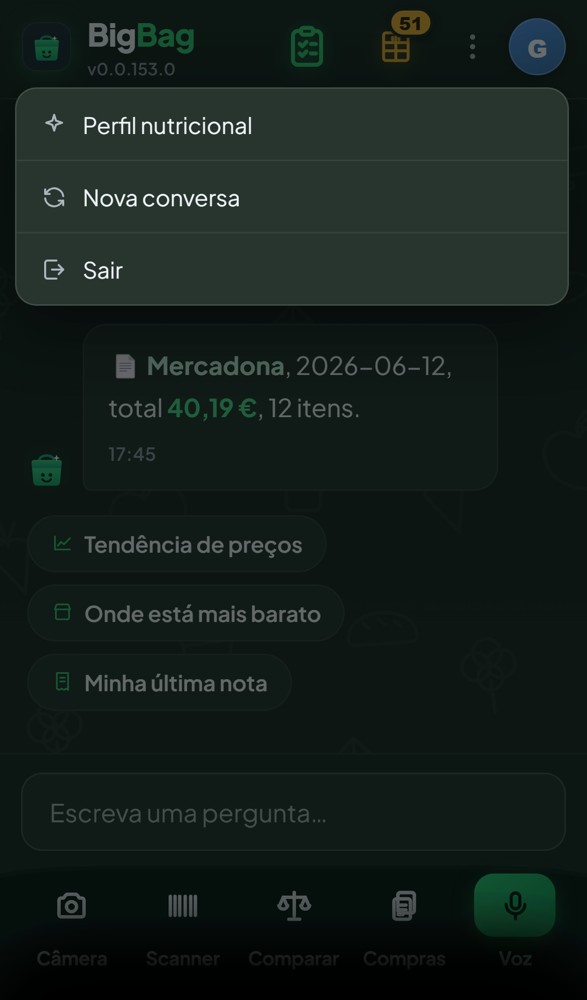
Menu curto: Perfil nutricional · Nova conversa · Sair.

## 7. Perfil nutricional · `07_perfil.png`
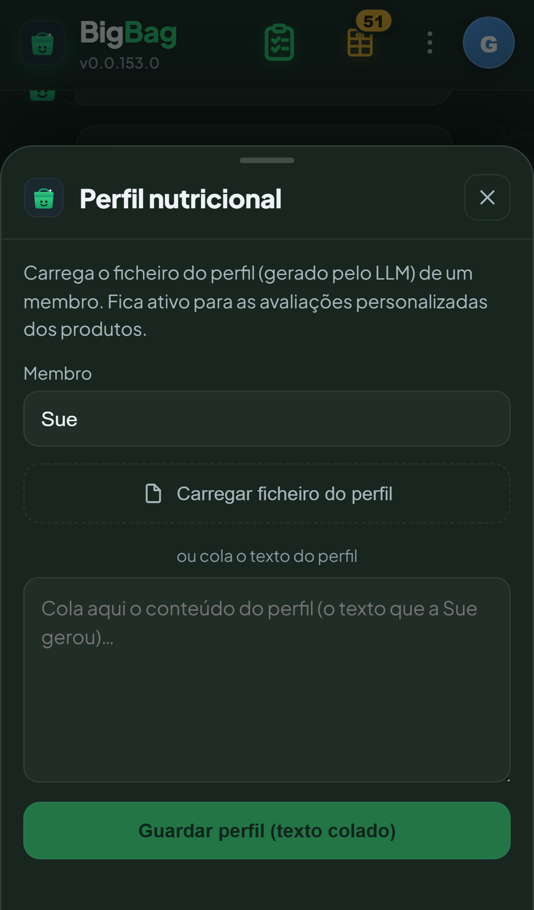
Carregar/colar o perfil (gerado por LLM) de um **membro** ("Sue"). Fica ativo para as avaliações personalizadas dos produtos.

## 8. Comparar produtos · `08_comparar.png`
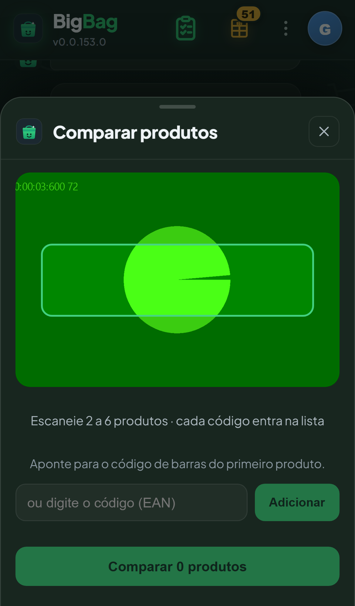
Scanner ao vivo (moldura) para ler 2–6 produtos e comparar lado a lado. Campo manual de EAN. *(A moldura verde com o disco é o vídeo de teste da câmara falsa; em uso real é a câmara.)*

## 9. Scanner / "Consultar produto" · `09_scanner.png` — ⚠️ CANDIDATA Nº 1 A REDESENHO
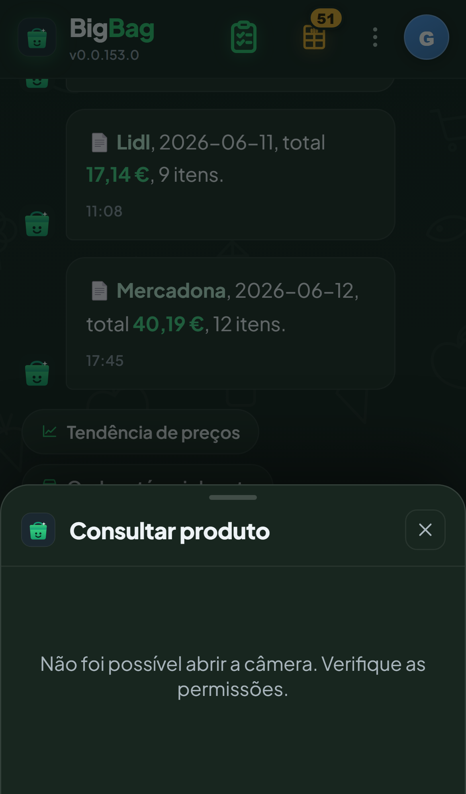
A tela mais sobrecarregada da app. Numa só folha empilha **quatro** formas de input com **dois objetivos diferentes misturados**:
- **Ler código de barras**: (a) câmara ao vivo com moldura; (b) "Não lê? Tire uma foto do código"; (c) "ou digite o código (EAN)" + botão **Consultar**.
- **Procurar por nome**: (d) "Consultar pelo nome (escreva ou fale)" — mic + campo + botão **Consultar**.

Problemas de UX evidentes:
1. **Dois botões "Consultar" idênticos** (um para nome, outro para EAN) na mesma tela.
2. **Dois objetivos não relacionados** competem pelo mesmo espaço (scan de código vs busca por nome).
3. **A MESMA tela é reutilizada em 3 fluxos** (consultar produto · adicionar à lista · adicionar à despensa — ver `13_scan_despensa.png`, idêntica) **sem adaptar ao contexto**: ao escanear para a despensa/lista, mostra "Consultar pelo nome", "tire uma foto" e EAN manual, que aí são ruído — o objetivo é só ler o código.
4. Hierarquia plana: 4 caixas com pesos visuais semelhantes, sem um caminho primário claro.

Direção possível (para o designer decidir): câmara como ação primária dominante; "por nome" e "EAN manual" recolhidos atrás de um "outras formas"; e **variar por contexto** (no fluxo despensa/lista, só ler código).

## 9b. Scan a partir da despensa · `13_scan_despensa.png`
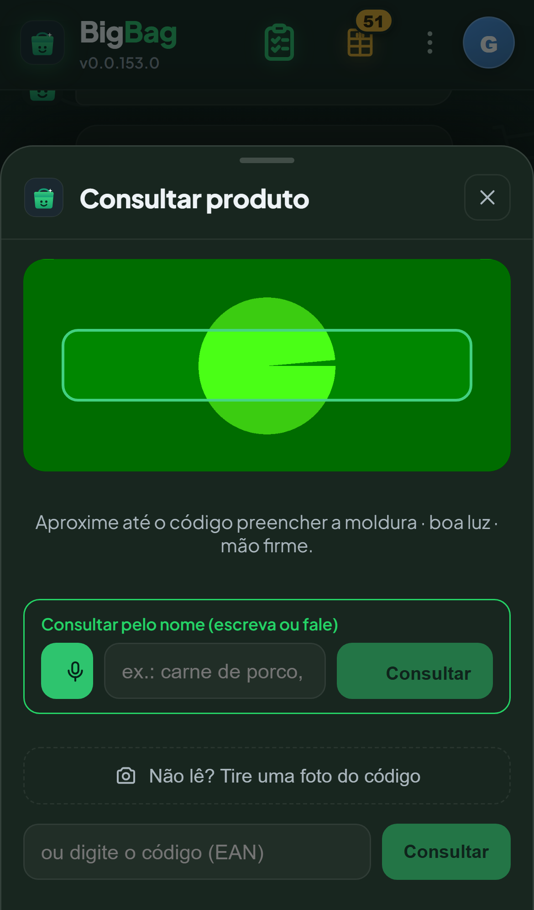
Prova do ponto 3 acima: abrir "Escanear produto" na despensa leva à **mesma** tela "Consultar produto" — com inputs que não servem o contexto.

## 10. Ficha de produto · `11_ficha.png`
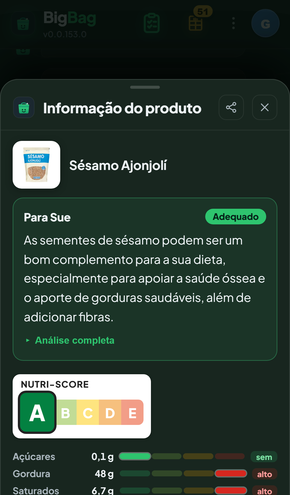
A tela mais rica. Imagem + nome · **parecer personalizado "Para Sue"** com selo (Adequado) e texto · "Análise completa" · **Nutri-Score** (A…E) · **réguas nutricionais** (açúcares/gordura/saturados com barra e rótulo baixo/alto). Factual, não-clínico.

## 11. Voz · `12_voz.png`
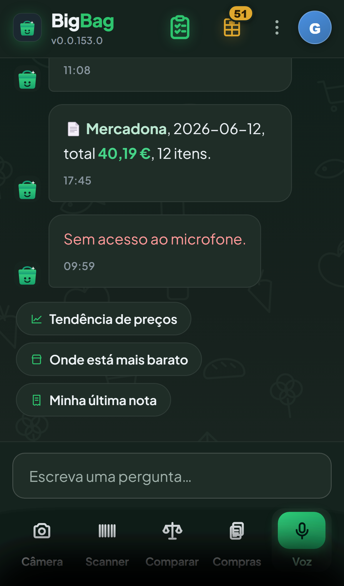
Captura de nota de voz (pergunta ou ditado para a lista).

---

## Observações factuais (input para o designer — não são decisões)

**Sistema visual.** Tema escuro verde-floresta; **verde** = lista/compras, **âmbar** = despensa (introduzido como teste para distinguir as duas listas). Cantos arredondados, bolhas de chat, sheets com handle de arrastar.

**Inconsistências/achados observados nesta captura:**
1. **Botão "Escanear produto" da despensa está VERDE**, não âmbar como o resto da despensa — o CSS `.pid-enviar-btn` (verde) sobrepõe-se ao `.desp-add` (âmbar). Quebra a linguagem de cor da superfície.
2. **Despensa lenta a abrir**: `GET /despensa` ~1,9 s para 51 itens (reutiliza todo o pipeline de enriquecimento da lista) → ~2 s de estado "…" antes do conteúdo. Falta um *skeleton*/loading melhor, ou caching.
3. **Classificação visível ao utilizador**: "Sésamo Ajonjolí" aparece em **Frutas e Vegetais** (devia ser mercearia/temperos).
4. **Nomes não traduzidos / em espanhol**: "Ajonjolí", "Sushi Rice", "Filetes de Cavala Del Sur **Contenido Reducido En Sal En Azeite**" (nome longo, corta em 2 linhas).
5. **Marca com loja colada**: "Campo Largo, Lidl".
6. **Menu kebab mistura naturezas**: ações de captura (digitalizar/galeria/PDF) + navegação (gastos, por identificar) + ferramenta (diagnóstico) — candidato a reorganização.
7. **Duas barras de navegação** competem pela atenção: ícones de topo (lista/despensa/kebab/avatar) + tab bar inferior (câmara/scanner/comparar/compras/voz). Há sobreposição funcional (scanner no topo via lista e em baixo via tab).

8. **A tela de scan "Consultar produto" (nº 9) é a candidata Nº 1 a redesenho** (decisão do dono): 4 inputs / 2 objetivos / 2 botões iguais, reutilizada sem adaptação em 3 fluxos. Ver detalhe na secção 9.

**Pontos fortes a preservar:** a ficha de produto (parecer personalizado + Nutri-Score + réguas) é densa mas legível; o gesto de swipe unificado (lista e despensa); a cor âmbar como distinção de superfície; o estado-vazio acionável da lista ("Começar por mim").

*Telas em falta neste lote (a capturar depois): lista COM itens (não capturada para não alterar dados reais), câmara inteligente, scanner a detetar, `/admin` e `/explorar`.*
